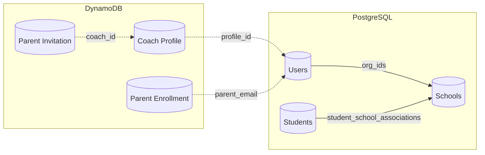

# 🗄️ TSA Database Schema Documentation

**Generated**: December 2024  
**Version**: v1  
**Environment**: Development/Production  

---

## 📋 Overview

The TSA (Texas Sports Academy) system uses a **hybrid database architecture** combining:
- **DynamoDB** - NoSQL for high-volume operational data, real-time features, and user profiles
- **PostgreSQL (RDS)** - Relational database for compliance, complex relationships, and academic records

This dual approach ensures:
- ✅ **Ed-Fi Compliance** - PostgreSQL handles standardized educational data formats
- ✅ **OneRoster Compatibility** - Structured user and organizational data
- ✅ **High Performance** - DynamoDB for real-time operations and caching
- ✅ **Scalability** - NoSQL for rapid growth and variable workloads

---

## 🏗️ Architecture Pattern

```mermaid
graph TB
    subgraph "Frontend Applications"
        COACH["🎓 Coach Portal"]
        PARENT["👨‍👩‍👧‍👦 Parent Portal"]
        ADMIN["👩‍💼 Admin Portal"]
    end

    subgraph "Application Services"
        COACH_SVC["Coach Service"]
        PARENT_SVC["Parent Service"]
        ADMIN_SVC["Admin Service"]
    end

    subgraph "Database Layer"
        subgraph "DynamoDB - Operational Data"
            PROFILES[("profilesdev")]
            INVITATIONS[("coach-invitationsdev")]
            ENROLLMENTS[("tsa-parent-enrollmentsdev")]
            AUDIT[("admin-audit-logsdev")]
        end

        subgraph "PostgreSQL - Compliance Data"
            SCHOOLS[("schools")]
            STUDENTS[("students")]
            USERS[("users")]
            ASSOCIATIONS[("student_school_associations")]
        end
    end

    COACH --> COACH_SVC
    PARENT --> PARENT_SVC
    ADMIN --> ADMIN_SVC

    COACH_SVC --> PROFILES
    COACH_SVC --> INVITATIONS
    COACH_SVC --> SCHOOLS

    PARENT_SVC --> ENROLLMENTS
    PARENT_SVC --> STUDENTS
    PARENT_SVC --> ASSOCIATIONS

    ADMIN_SVC --> AUDIT
    ADMIN_SVC --> USERS
```



---

# 🚀 DynamoDB Tables (NoSQL)

## Table Naming Convention
All DynamoDB tables follow the pattern: `{logical-name}-{stage}`

### 📊 **Coach Portal Tables**

#### 1. **profilesdev**
**Purpose**: Coach profiles and operational data  
**Access Pattern**: Single coach lookups, coach-by-school queries

| Attribute | Type | Key Type | Description |
|-----------|------|----------|-------------|
| `coach_id` | String | HASH | Primary key - unique coach identifier |
| `first_name` | String | - | Coach first name |
| `last_name` | String | - | Coach last name |
| `email` | String | - | Contact email |
| `phone` | String | - | Phone number |
| `school_id` | String | GSI | School association |
| `sport_specialties` | List | - | Sports coached |
| `profile_status` | String | - | active, inactive, pending |
| `created_at` | String | - | ISO timestamp |
| `updated_at` | String | - | ISO timestamp |

**Global Secondary Indexes**:
- `school-index`: Hash key = `school_id`

---

#### 2. **coach-onboarding-sessionsdev**
**Purpose**: Temporary onboarding session data with TTL  
**Access Pattern**: Session-based lookups during onboarding

| Attribute | Type | Key Type | Description |
|-----------|------|----------|-------------|
| `session_id` | String | HASH | Primary key - session identifier |
| `coach_id` | String | - | Associated coach |
| `onboarding_step` | String | - | Current step in process |
| `form_data` | Map | - | Collected form information |
| `expiration_time` | Number | TTL | Auto-delete timestamp |
| `created_at` | String | - | Session start time |

**TTL Configuration**: Auto-delete after 24 hours of inactivity

---

#### 3. **parent-invitationsdev**
**Purpose**: Parent invitations sent by coaches  
**Access Pattern**: Coach-sent invitations, parent lookup by email

| Attribute | Type | Key Type | Description |
|-----------|------|----------|-------------|
| `invitation_id` | String | HASH | Primary key - unique invitation |
| `coach_id` | String | GSI | Sending coach |
| `parent_email` | String | GSI | Recipient email |
| `student_name` | String | - | Student being enrolled |
| `sport` | String | - | Sport for enrollment |
| `invitation_status` | String | - | sent, opened, accepted, expired |
| `magic_link_token` | String | - | Secure access token |
| `expires_at` | String | - | Invitation expiration |
| `sent_at` | String | - | Send timestamp |
| `responded_at` | String | - | Response timestamp |

**Global Secondary Indexes**:
- `coach-invitations-index`: Hash key = `coach_id`
- `parent-email-index`: Hash key = `parent_email`

---

### 👨‍👩‍👧‍👦 **Parent Portal Tables**

#### 4. **tsa-parent-enrollmentsdev**
**Purpose**: Student enrollment records and progress tracking  
**Access Pattern**: Parent-based lookups, student progress queries

| Attribute | Type | Key Type | Description |
|-----------|------|----------|-------------|
| `enrollment_id` | String | HASH | Primary key - unique enrollment |
| `parent_email` | String | GSI | Parent identifier |
| `student_name` | String | - | Student full name |
| `student_age` | Number | - | Current age |
| `sport` | String | - | Primary sport |
| `coach_id` | String | GSI | Assigned coach |
| `enrollment_status` | String | - | pending, active, completed |
| `progress_milestones` | List | - | Completed steps |
| `payment_status` | String | - | paid, pending, overdue |
| `start_date` | String | - | Enrollment start |
| `created_at` | String | - | Record creation |

**Global Secondary Indexes**:
- `parent-enrollments-index`: Hash key = `parent_email`
- `coach-enrollments-index`: Hash key = `coach_id`

---

#### 5. **tsa-parent-documentsdev**
**Purpose**: Document upload tracking and verification  
**Access Pattern**: Parent document lookups, document type queries

| Attribute | Type | Key Type | Description |
|-----------|------|----------|-------------|
| `document_id` | String | HASH | Primary key - unique document |
| `enrollment_id` | String | GSI | Associated enrollment |
| `parent_email` | String | GSI | Document owner |
| `document_type` | String | - | medical, legal, identification |
| `file_name` | String | - | Original filename |
| `s3_key` | String | - | S3 storage location |
| `file_size` | Number | - | Size in bytes |
| `upload_status` | String | - | uploaded, processing, verified |
| `verification_status` | String | - | pending, approved, rejected |
| `verified_by` | String | - | Coach/admin who verified |
| `uploaded_at` | String | - | Upload timestamp |
| `verified_at` | String | - | Verification timestamp |

**Global Secondary Indexes**:
- `enrollment-documents-index`: Hash key = `enrollment_id`
- `parent-documents-index`: Hash key = `parent_email`

---

#### 6. **tsa-parent-schedulingdev**
**Purpose**: Consultation and shadow day scheduling  
**Access Pattern**: Coach schedule management, parent appointment booking

| Attribute | Type | Key Type | Description |
|-----------|------|----------|-------------|
| `appointment_id` | String | HASH | Primary key - unique appointment |
| `coach_id` | String | GSI | Coach providing service |
| `parent_email` | String | GSI | Parent booking appointment |
| `student_name` | String | - | Student participating |
| `appointment_type` | String | - | consultation, shadow_day, assessment |
| `scheduled_date` | String | - | Appointment date (ISO) |
| `start_time` | String | - | Start time |
| `end_time` | String | - | End time |
| `status` | String | - | scheduled, confirmed, completed, cancelled |
| `location` | String | - | Meeting location |
| `notes` | String | - | Special instructions |
| `confirmation_sent` | Boolean | - | Email confirmation status |
| `created_at` | String | - | Booking timestamp |

**Global Secondary Indexes**:
- `coach-schedule-index`: Hash key = `coach_id`, Sort key = `scheduled_date`
- `parent-appointments-index`: Hash key = `parent_email`

---

### 👩‍💼 **Admin Portal Tables**

#### 7. **coach-invitationsdev**
**Purpose**: Coach invitations sent by admin portal  
**Access Pattern**: Admin invitation management, coach onboarding tracking

| Attribute | Type | Key Type | Description |
|-----------|------|----------|-------------|
| `invitation_id` | String | HASH | Primary key - unique invitation |
| `admin_email` | String | - | Sending administrator |
| `coach_email` | String | GSI | Invited coach email |
| `first_name` | String | - | Coach first name |
| `last_name` | String | - | Coach last name |
| `school_name` | String | - | Assigned school |
| `sport` | String | - | Primary sport |
| `invitation_status` | String | - | sent, accepted, expired, cancelled |
| `magic_link_token` | String | - | Secure onboarding token |
| `permissions` | List | - | Granted permissions |
| `expires_at` | String | - | Invitation expiration |
| `sent_at` | String | - | Send timestamp |
| `accepted_at` | String | - | Acceptance timestamp |

**Global Secondary Indexes**:
- `coach-email-index`: Hash key = `coach_email`

---

#### 8. **admin-audit-logsdev**
**Purpose**: Admin action audit trail  
**Access Pattern**: Admin action tracking, compliance reporting

| Attribute | Type | Key Type | Description |
|-----------|------|----------|-------------|
| `log_id` | String | HASH | Primary key - unique log entry |
| `admin_email` | String | GSI | Acting administrator |
| `action_type` | String | GSI | create, update, delete, view |
| `resource_type` | String | - | coach, parent, enrollment, setting |
| `resource_id` | String | - | Affected resource identifier |
| `action_description` | String | - | Human-readable description |
| `before_state` | Map | - | Resource state before action |
| `after_state` | Map | - | Resource state after action |
| `ip_address` | String | - | Administrator IP |
| `user_agent` | String | - | Browser/client information |
| `session_id` | String | - | Admin session identifier |
| `timestamp` | String | - | Action timestamp (ISO) |

**Global Secondary Indexes**:
- `admin-actions-index`: Hash key = `admin_email`, Sort key = `timestamp`
- `action-type-index`: Hash key = `action_type`, Sort key = `timestamp`

---

### 🔮 **Future Tables**

#### 9. **organizations-dev**
**Purpose**: School/organization data (future implementation)

#### 10. **students-dev**
**Purpose**: Student enrollment data (future implementation)

---

# 🐘 PostgreSQL Tables (RDS)

## Compliance Focus
PostgreSQL handles **Ed-Fi** and **OneRoster** compliant data structures for educational standards and reporting.

### 🏫 **Ed-Fi Compliant Academic Tables**

#### **schools**
**Purpose**: Ed-Fi compliant school information  
**Standard**: Ed-Fi Data Standard v5.2

```sql
CREATE TABLE schools (
    school_id INTEGER PRIMARY KEY,
    state_organization_id VARCHAR(60) NOT NULL,
    name_of_institution VARCHAR(255) NOT NULL,
    short_name_of_institution VARCHAR(100),
    web_site VARCHAR(255),
    operational_status_descriptor VARCHAR(50),
    type_descriptor VARCHAR(50),
    charter_status_descriptor VARCHAR(50),
    local_education_agency_id INTEGER,
    
    -- Contact Information (Ed-Fi Address structure)
    addresses JSONB DEFAULT '[]',
    telephones JSONB DEFAULT '[]',
    
    -- School Categories and Grade Levels
    school_categories JSONB DEFAULT '[]',
    grade_levels JSONB DEFAULT '[]',
    
    -- Ed-Fi Metadata
    _etag VARCHAR(50),
    _last_modified_date TIMESTAMP DEFAULT CURRENT_TIMESTAMP,
    
    created_at TIMESTAMP DEFAULT CURRENT_TIMESTAMP,
    updated_at TIMESTAMP DEFAULT CURRENT_TIMESTAMP
);
```

**Key Indexes**:
- `idx_schools_lea` on `local_education_agency_id`
- `idx_schools_state_org` on `state_organization_id`
- `idx_schools_operational_status` on `operational_status_descriptor`

---

#### **students**
**Purpose**: Ed-Fi compliant student records  
**Standard**: Ed-Fi Data Standard v5.2

```sql
CREATE TABLE students (
    student_unique_id VARCHAR(50) PRIMARY KEY,
    student_usi INTEGER UNIQUE NOT NULL,
    
    -- Personal Information
    first_name VARCHAR(100) NOT NULL,
    last_name VARCHAR(100) NOT NULL,
    middle_name VARCHAR(100),
    generation_code_suffix VARCHAR(10),
    
    -- Demographics
    birth_date DATE,
    birth_city VARCHAR(100),
    birth_state_abbreviation_descriptor VARCHAR(50),
    hispanic_latino_ethnicity BOOLEAN,
    races JSONB DEFAULT '[]',
    
    -- Ed-Fi Metadata
    _etag VARCHAR(50),
    _last_modified_date TIMESTAMP DEFAULT CURRENT_TIMESTAMP,
    
    created_at TIMESTAMP DEFAULT CURRENT_TIMESTAMP,
    updated_at TIMESTAMP DEFAULT CURRENT_TIMESTAMP
);
```

**Key Indexes**:
- `idx_students_birth_date` on `birth_date`
- `idx_students_ethnicity` on `hispanic_latino_ethnicity`

---

#### **student_school_associations**
**Purpose**: Ed-Fi compliant student-school enrollment relationships  
**Standard**: Ed-Fi Data Standard v5.2

```sql
CREATE TABLE student_school_associations (
    student_unique_id VARCHAR(50) NOT NULL,
    school_id INTEGER NOT NULL,
    entry_date DATE NOT NULL,
    
    PRIMARY KEY (student_unique_id, school_id, entry_date),
    FOREIGN KEY (student_unique_id) REFERENCES students(student_unique_id),
    FOREIGN KEY (school_id) REFERENCES schools(school_id),
    
    -- Entry Information
    entry_grade_level_descriptor VARCHAR(50),
    entry_type_descriptor VARCHAR(50),
    repeat_grade_indicator BOOLEAN,
    
    -- Exit Information
    exit_withdraw_date DATE,
    exit_withdraw_type_descriptor VARCHAR(50),
    
    -- Academic Information
    class_of_school_year INTEGER,
    school_year INTEGER NOT NULL,
    
    -- Ed-Fi Metadata
    _etag VARCHAR(50),
    _last_modified_date TIMESTAMP DEFAULT CURRENT_TIMESTAMP,
    
    created_at TIMESTAMP DEFAULT CURRENT_TIMESTAMP,
    updated_at TIMESTAMP DEFAULT CURRENT_TIMESTAMP
);
```

**Key Indexes**:
- `idx_student_school_student` on `student_unique_id`
- `idx_student_school_year` on `school_year`
- `idx_student_school_active` on `(school_id, school_year)` WHERE `exit_withdraw_date IS NULL`

---

### 📚 **OneRoster Compliant Tables**

#### **organizations**
**Purpose**: OneRoster compliant organizational structure  
**Standard**: OneRoster v1.2

```sql
CREATE TABLE organizations (
    sourced_id VARCHAR(255) PRIMARY KEY,
    status VARCHAR(20) DEFAULT 'active',
    date_last_modified TIMESTAMP DEFAULT CURRENT_TIMESTAMP,
    metadata JSONB,
    name VARCHAR(255) NOT NULL,
    type VARCHAR(50) NOT NULL, -- school, district, department
    identifier VARCHAR(255),
    parent_id VARCHAR(255) REFERENCES organizations(sourced_id)
);
```

**Key Indexes**:
- `idx_organizations_type` on `type`
- `idx_organizations_parent` on `parent_id`

---

#### **users**
**Purpose**: OneRoster compliant user management  
**Standard**: OneRoster v1.2

```sql
CREATE TABLE users (
    sourced_id VARCHAR(255) PRIMARY KEY,
    status VARCHAR(20) DEFAULT 'active',
    date_last_modified TIMESTAMP DEFAULT CURRENT_TIMESTAMP,
    metadata JSONB,
    username VARCHAR(255) UNIQUE,
    enabled_user BOOLEAN DEFAULT true,
    
    -- Name fields
    given_name VARCHAR(255),
    family_name VARCHAR(255),
    middle_name VARCHAR(255),
    
    -- Role and Contact
    role VARCHAR(50) NOT NULL, -- student, teacher, administrator, parent, guardian
    email VARCHAR(255),
    phone VARCHAR(20),
    
    -- Organizational
    org_ids JSONB, -- Array of organization IDs
    grades JSONB,  -- Array of grade levels
    
    -- DynamoDB Integration
    profile_id VARCHAR(255), -- Links to DynamoDB profiles
    
    created_at TIMESTAMP DEFAULT CURRENT_TIMESTAMP,
    updated_at TIMESTAMP DEFAULT CURRENT_TIMESTAMP
);
```

**Key Indexes**:
- `idx_users_role_org` on `(role, (org_ids->>0))`
- `idx_users_email` on `email`
- `idx_users_profile_id` on `profile_id`

---

### 🔄 **Data Sync Tables**

#### **profile_sync_log**
**Purpose**: Track synchronization between DynamoDB profiles and PostgreSQL users

```sql
CREATE TABLE profile_sync_log (
    sync_id UUID PRIMARY KEY DEFAULT uuid_generate_v4(),
    profile_id VARCHAR(255) NOT NULL,
    user_sourced_id VARCHAR(255),
    sync_type VARCHAR(50) NOT NULL, -- 'create', 'update', 'delete'
    sync_status VARCHAR(20) DEFAULT 'pending',
    sync_data JSONB,
    error_message TEXT,
    created_at TIMESTAMP DEFAULT CURRENT_TIMESTAMP,
    completed_at TIMESTAMP
);
```

---

## 🔗 **Database Relationships**

### **Cross-Database References**


### **Data Flow Patterns**
1. **Coach Onboarding**: DynamoDB → PostgreSQL sync via `profile_sync_log`
2. **Student Enrollment**: PostgreSQL compliance data → DynamoDB operational data
3. **Cross-Reference**: `users.profile_id` links to DynamoDB coach profiles
4. **Audit Trail**: All admin actions logged in DynamoDB for real-time access

---

## 🛠️ **Environment Configuration**

### **DynamoDB Environment Variables**
```bash
# Coach Portal
PROFILES_TABLE=profilesdev
ONBOARDING_TABLE=coach-onboarding-sessionsdev
PARENT_INVITATIONS_TABLE=parent-invitationsdev

# Parent Portal
ENROLLMENTS_TABLE=tsa-parent-enrollmentsdev
DOCUMENTS_TABLE=tsa-parent-documentsdev
SCHEDULING_TABLE=tsa-parent-schedulingdev

# Admin Portal
INVITATIONS_TABLE=coach-invitationsdev
AUDIT_LOGS_TABLE=admin-audit-logsdev

# Future
ORGANIZATIONS_TABLE=organizations-dev
STUDENTS_TABLE=students-dev
```

### **PostgreSQL Connection**
```bash
# RDS Configuration
DATABASE_HOST=<rds-instance-endpoint>
DATABASE_NAME=coach_portal
DATABASE_PORT=5432
DATABASE_SECRET_ARN=<secrets-manager-arn>
```

---

## 🎯 **Performance Optimizations**

### **DynamoDB**
- ✅ **Single-table design** where appropriate
- ✅ **GSI for query patterns** (coach-by-school, parent-by-email)
- ✅ **TTL for temporary data** (onboarding sessions)
- ✅ **Pay-per-request billing** for cost optimization

### **PostgreSQL**
- ✅ **Composite indexes** for Ed-Fi compliance queries
- ✅ **JSONB for flexible metadata** while maintaining structure
- ✅ **Foreign key constraints** for data integrity
- ✅ **Automatic timestamp triggers** for audit trails

---

## 🔐 **Security & Compliance**

### **Data Privacy**
- 🔒 **FERPA Compliance** - Educational records protection
- 🔒 **PII Encryption** - At rest and in transit
- 🔒 **IAM Role-based Access** - Least privilege principle
- 🔒 **Audit Logging** - All admin actions tracked

### **Access Patterns**
- 👤 **Coaches**: Read/write own profile, read assigned students
- 👨‍👩‍👧‍👦 **Parents**: Read/write own enrollments, read assigned coach info
- 👩‍💼 **Admins**: Full read/write access with audit logging

---

## 📈 **Monitoring & Metrics**

### **Key Metrics to Monitor**
- **DynamoDB**: Read/write capacity, throttling, GSI usage
- **PostgreSQL**: Connection pool, query performance, disk usage
- **Cross-database**: Sync success rates, data consistency checks

### **Alerting Thresholds**
- DynamoDB throttling > 1%
- PostgreSQL connections > 80% of max
- Sync failures > 5 per hour
- Database lag > 500ms

---

## 🚀 **Migration & Deployment**

### **Database Versioning**
All tables include version numbers (`v1`) for schema evolution:
- **Breaking changes**: New version (`v2`)
- **Non-breaking changes**: Same version with migration scripts
- **Rollback strategy**: Previous version maintained during transition

### **Deployment Strategy**
1. **Infrastructure**: CDK creates all tables and indexes
2. **Schema migration**: SQL scripts run via Lambda
3. **Data migration**: Gradual sync between versions
4. **Validation**: Automated consistency checks

---

*This documentation is automatically generated from the CDK infrastructure code and reflects the current state of the TSA database architecture.* 