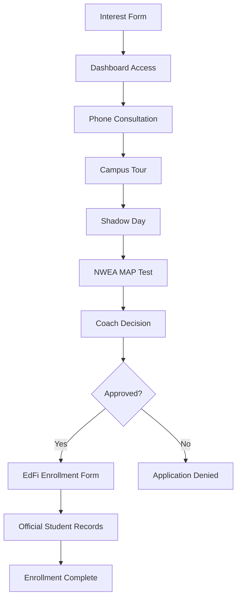

# TSA Enrollment Pipeline Integration

## Overview ✅

The Texas Sports Academy enrollment process has been **correctly integrated** with EdFi/OneRoster compliance data collection at the appropriate stage in the pipeline.

## TSA Enrollment Process Flow 🎯

### 1. **Interest Form** (Entry Point)
- Parents submit basic interest form
- Collects: Name, contact info, sport interest, basic student details
- **Result**: Dashboard access granted

### 2. **Dashboard Access** 
- Parents get access to comprehensive parent portal
- Can view enrollment pipeline status
- Access to scheduling, communication, documents

### 3. **Phone Consultation**
- Schedule call with coaching staff
- Discuss student goals, TSA programs
- Initial fit assessment

### 4. **Campus Tour**
- Visit TSA facilities
- Meet coaches and staff  
- See training environment

### 5. **Shadow Day Experience**
- Student participates in full day of activities
- Experience TSA culture and training
- Interaction with current students

### 6. **NWEA MAP Test**
- Academic assessment for placement
- Determines readiness level
- Used for program recommendations

### 7. **Coach Decision** (Critical Gate)
- Coach reviews all previous steps
- Makes enrollment approval/rejection decision
- **THIS IS THE KEY DECISION POINT**

### 8. **Enrollment Completion** (EdFi Form Triggered)
- **ONLY IF APPROVED**: Comprehensive EdFi form appears
- Collects all federal reporting demographics
- Creates official student records
- **Student is officially enrolled**

## Integration Architecture 🏗️

### Components Created

#### 1. `EnrollmentPipeline.tsx`
```typescript
// Shows complete 8-step TSA enrollment process
// Tracks current step and status
// Integrates scheduling actions for each step
// Triggers EdFi form ONLY after coach approval

<EnrollmentPipeline
  enrollmentId="TSA-ENROLL-20240101-ABC123"
  currentStepId="phone_consultation" 
  studentName="Emma Johnson"
  coachName="Sarah Williams"
  isApproved={false}
/>
```

#### 2. `ComprehensiveEnrollmentForm.tsx` (Updated)
```typescript
// 6-step EdFi/OneRoster compliant form
// Only shown AFTER coach approval
// Collects all federal reporting demographics
// Creates official student records

// Sections:
// 1. Student Demographics (basic + generation suffix)
// 2. Birth & Immigration (EdFi compliance fields)
// 3. Ethnicity & Race (federal reporting)
// 4. Parent/Guardian (OneRoster user data)
// 5. Academic History (previous schools, special needs)
// 6. Medical Information (health records)
```

### Data Flow



## Smart EdFi Integration 🧠

### **Why This Approach is Correct**

1. **No Wasted Effort**: Parents don't fill out comprehensive forms until they're actually accepted
2. **Better Conversion**: Simpler initial process reduces abandonment
3. **Compliance Only When Needed**: EdFi data collected only for students who will actually enroll
4. **Coach Screening**: Ensures only suitable students go through full enrollment
5. **Federal Reporting Ready**: All approved students have complete compliance data

### **Wrong Approach** ❌
```
Interest Form → Full EdFi Form → Assessment → Coach Decision
```
*Problems: High abandonment, wasted effort, collecting sensitive data unnecessarily*

### **Correct Approach** ✅  
```
Interest Form → Assessment Pipeline → Coach Approval → EdFi Form → Enrollment
```
*Benefits: Higher conversion, streamlined process, compliance at right time*

## Implementation Details

### 1. Parent Portal Dashboard Integration

The `EnrollmentPipeline` component is now the main content in the parent dashboard:

```typescript
// In /app/(parents)/page.tsx
<EnrollmentPipeline
  enrollmentId="TSA-ENROLL-20240101-ABC123"
  currentStepId="phone_consultation" // Dynamic from API
  studentName="Emma Johnson"         // From enrollment data  
  coachName="Sarah Williams"         // From coach assignment
  isApproved={false}                 // From coach decision
/>
```

### 2. Step-Specific Actions

Each step has appropriate action buttons:

```typescript
// Phone Consultation
<Button onClick={() => window.location.href = '/schedule?type=consultation'}>
  Schedule Phone Consultation
</Button>

// Campus Tour  
<Button onClick={() => window.location.href = '/schedule?type=tour'}>
  Schedule Campus Tour
</Button>

// Shadow Day
<Button onClick={() => window.location.href = '/schedule?type=shadow-day'}>
  Schedule Shadow Day
</Button>

// NWEA Assessment
<Button onClick={() => window.location.href = '/assessment/nwea'}>
  Take NWEA MAP Test
</Button>

// EdFi Form (ONLY if approved)
{isApproved && currentStepId === 'enrollment_completion' && (
  <Button onClick={() => setShowEnrollmentForm(true)}>
    Complete Comprehensive Enrollment
  </Button>
)}
```

### 3. Status-Based UI

```typescript
// Different states based on coach decision
{isApproved && (
  <div className="bg-green-50 border border-green-200 rounded-lg p-6">
    <h4>Congratulations! Enrollment Approved</h4>
    <p>Complete the final enrollment form to officially join TSA.</p>
  </div>
)}

{currentStepId === 'coach_decision' && !isApproved && (
  <div className="bg-amber-50 border border-amber-200 rounded-lg p-6">
    <h4>Under Review</h4>
    <p>Coach is reviewing the application...</p>
  </div>
)}
```

## Backend Integration Points

### 1. Enrollment Status API
```python
# GET /admissions/enrollments/{enrollment_id}/status
{
  "enrollment_id": "TSA-ENROLL-20240101-ABC123",
  "current_step_id": "phone_consultation",
  "student_name": "Emma Johnson",
  "coach_name": "Sarah Williams", 
  "is_approved": false,
  "completed_steps": ["interest", "dashboard_access"],
  "next_action": "Schedule phone consultation"
}
```

### 2. Coach Decision API
```python
# POST /coach/enrollments/{enrollment_id}/decision
{
  "decision": "approved|rejected",
  "notes": "Student shows excellent potential...",
  "recommended_program": "full_time"
}
```

### 3. EdFi Form Submission
```python
# POST /admissions/enrollments/{enrollment_id}/complete
{
  "student_demographics": { /* EdFi data */ },
  "parent_guardian": { /* OneRoster data */ },
  "academic_history": { /* School records */ },
  "medical_information": { /* Health data */ }
}
```

## Database Impact

### Updated Step 4 Validation
```python
# In shared_utils/shared_utils.py
def validate_enrollment_step(step_data: Dict[str, Any], step_number: int):
    if step_number == 4:  # Now the EdFi completion step
        # Require ALL EdFi demographic fields
        required_student_fields = [
            'first_name', 'last_name', 'birth_date', 'grade_level',
            'birth_sex_descriptor', 'hispanic_latino_ethnicity', 'races',
            'birth_city', 'birth_state_abbreviation_descriptor'
        ]
        # Full validation for comprehensive enrollment
```

### Student Record Creation
```python
# In lambda_parent_enrollment/student_creation.py
# Triggered ONLY after step 4 (EdFi form) completion
# Now has access to complete demographic data:
{
    'student_unique_id': generate_student_unique_id(enrollment_data),
    'student_usi': generate_student_usi(),
    'first_name': student_info.get('first_name'),
    'last_name': student_info.get('last_name'),
    'middle_name': student_info.get('middle_name'),
    'generation_code_suffix': student_info.get('generation_code_suffix'),
    'birth_date': parse_birth_date(student_info.get('birth_date')),
    'birth_city': student_info.get('birth_city'),              # ✅ Now available
    'birth_state_abbreviation_descriptor': student_info.get('birth_state_abbreviation_descriptor'), # ✅ Now available
    'birth_country_descriptor': student_info.get('birth_country_descriptor'), # ✅ Now available
    'birth_sex_descriptor': student_info.get('birth_sex_descriptor'), # ✅ Now available
    'multiplebirth_status': student_info.get('multiplebirth_status'), # ✅ Now available
    'date_entered_us': parse_date(student_info.get('date_entered_us')), # ✅ Now available
    'hispanic_latino_ethnicity': student_info.get('hispanic_latino_ethnicity'), # ✅ Now available
    'races': format_race_data(student_info.get('races', [])), # ✅ Now available
    # ... all other EdFi fields now populated
}
```

## Benefits of This Integration ✅

### 1. **User Experience**
- **Streamlined Process**: Parents see clear pipeline with next steps
- **Reduced Abandonment**: No overwhelming forms upfront
- **Clear Expectations**: Understand full process from start
- **Status Transparency**: Always know where they stand

### 2. **Operational Efficiency**
- **Coach Screening**: Filter candidates before data collection
- **Resource Management**: Only collect comprehensive data for approved students  
- **Clear Handoffs**: Each step has defined entry/exit criteria
- **Automated Workflows**: System guides users through process

### 3. **Compliance & Reporting**
- **EdFi Ready**: All enrolled students have complete federal reporting data
- **OneRoster Compatible**: User management data properly collected
- **Data Quality**: Comprehensive validation at enrollment completion
- **Audit Trail**: Complete process tracking for each student

### 4. **Business Intelligence**
- **Pipeline Analytics**: Track conversion at each step
- **Bottleneck Identification**: See where students drop off
- **Coach Performance**: Track approval rates and decision speed
- **Process Optimization**: Data-driven improvements

## Next Steps

1. **API Integration**: Connect pipeline to backend enrollment APIs
2. **Coach Dashboard**: Build coach approval interface
3. **NWEA Integration**: Connect MAP test results to pipeline
4. **Scheduling System**: Build comprehensive appointment system
5. **Analytics Dashboard**: Track pipeline metrics

## Summary

The TSA enrollment pipeline now **correctly integrates** the comprehensive EdFi compliance form at the appropriate stage - **AFTER coach approval**. This ensures:

- ✅ **Right Data at Right Time**: EdFi demographics collected only for enrolled students
- ✅ **Better UX**: Simplified initial process, comprehensive only when needed  
- ✅ **Federal Compliance**: All enrolled students have complete reporting data
- ✅ **Operational Efficiency**: Coach screening before comprehensive data collection
- ✅ **Clear Process**: Parents understand full journey from interest to enrollment

This approach maximizes both user experience and compliance while respecting the natural flow of the TSA admissions process. 